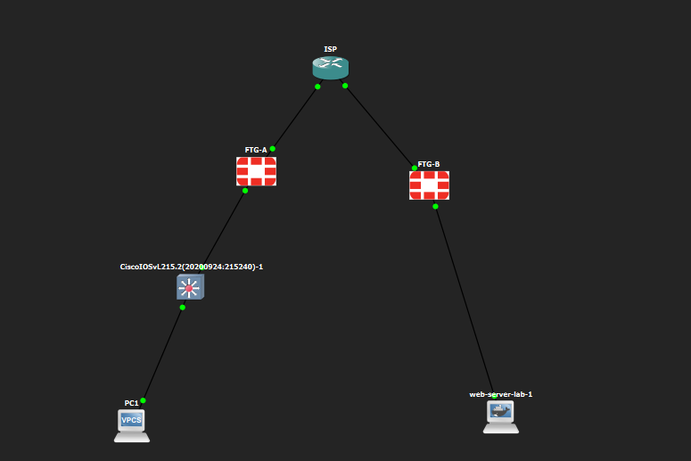
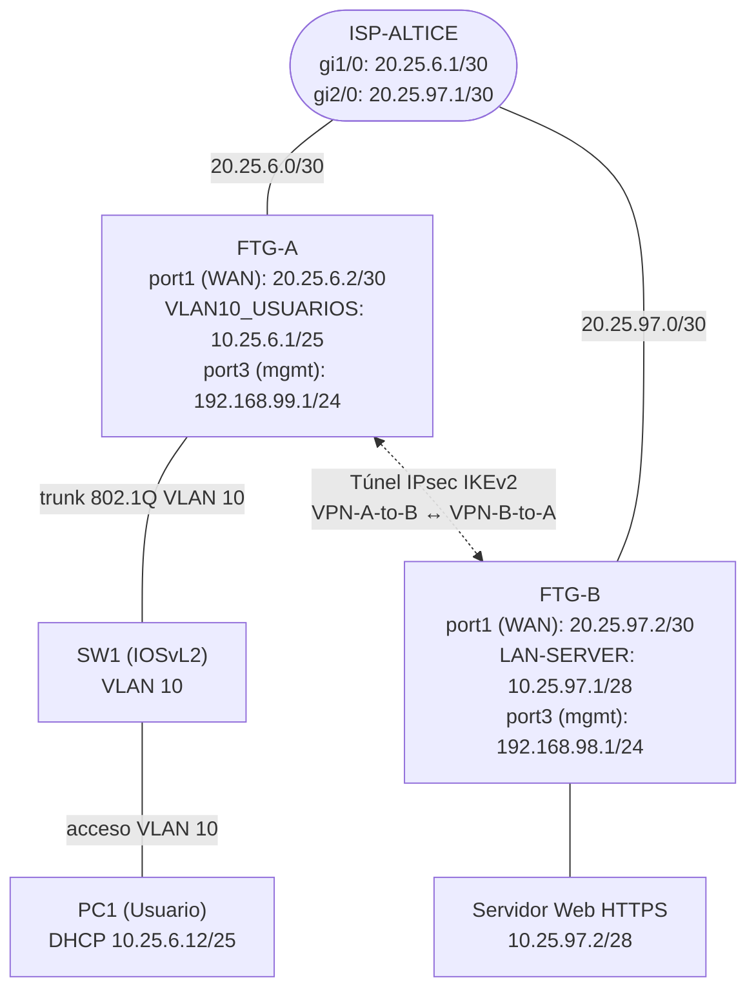
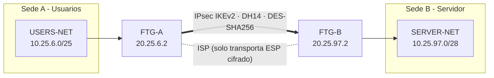

# Laboratorio VPN Site-to-Site IPsec con FortiGate (FTG-A ↔ FTG-B)

> **Autora:** Emely Carrasco · **Matrícula:** 2025-0697

## 🎬 Video demostrativo
(https://www.youtube.com/watch?v=2OKJWqRRx58)
---

## 📌 Propósito del laboratorio

Implementar y demostrar una **VPN IPsec Site-to-Site (IKEv2)** entre dos firewalls FortiGate a través de un ISP simulado, de modo que un **usuario** (VLAN 10, con DHCP) pueda comunicarse con un **servidor web HTTPS** ubicado en otra sede, y comprobar que **la comunicación solo fluye si el túnel VPN está activo**.

### Objetivos

1. Comunicar el usuario con el servidor web a través del enlace VPN.
2. Comprobar que el tráfico solo fluye con la VPN activa (rutas *blackhole* de respaldo que cortan el tráfico cuando el túnel cae).
3. Configurar en ambos FortiGate (**100 % por GUI**): interfaces, NAT, políticas de firewall, rutas estáticas y VPN Site-to-Site.
4. Configurar el ISP con IPs públicas, un servidor web HTTPS (/28) y un segmento de usuarios (/25) en VLAN 10 con DHCP y traceroute hacia el servidor.

## 🗺️ Topología

## 🔐 Diagrama del túnel VPN

## 📚 Contenido del repositorio

| Carpeta / archivo | Descripción |
|---|---|
| [`docs/01-direccionamiento.md`](docs/01-direccionamiento.md) | Redes, IPs, parámetros VPN y rutas |
| [`docs/02-configuracion-isp-switch.md`](docs/02-configuracion-isp-switch.md) | Configuración de ISP y SW1 (CLI) |
| [`docs/03-configuracion-fortigate-a.md`](docs/03-configuracion-fortigate-a.md) | FortiGate A por GUI (con capturas) |
| [`docs/04-configuracion-fortigate-b.md`](docs/04-configuracion-fortigate-b.md) | FortiGate B por GUI (con capturas) |
| [`docs/05-pruebas-y-verificacion.md`](docs/05-pruebas-y-verificacion.md) | Pruebas con VPN **activa** y **caída** |
| [`configs/`](configs/) | Running-configs de ISP, SW1, FTG-A y FTG-B |
| [`scripts/`](scripts/) | Scripts de pruebas y del servidor web |
| [`images/`](images/) | Todas las capturas usadas en la documentación |

## ✅ Resumen de resultados

| Prueba | VPN activa | VPN caída |
|---|---|---|
| Ping PC1 → Servidor (10.25.97.2) | ✅ 4/4 respuestas, TTL 62 | ❌ *Red de destino inaccesible* (10.25.6.1) |
| Tracert → Servidor | ✅ 3 saltos (10.25.6.1 → 20.25.97.2 → 10.25.97.2) | ❌ Se detiene en 10.25.6.1 |
| HTTPS al servidor | ✅ Página Apache2 | ❌ Tiempo de espera agotado |
| Estado IPsec (Monitor) | 🟢 Up | 🔴 Down |

**Conclusión:** la comunicación entre el usuario y el servidor solo existe mientras el túnel VPN está establecido.

## 🛠️ Tecnologías

GNS3 · FortiGate VM64-KVM · Cisco IOSv / IOSvL2 · Ubuntu + Apache2 · VPCS/Windows como cliente
