# 03 · Configuración de FortiGate A (FTG-A) — por GUI

Running-config: [`configs/fgt-a-running-config.conf`](../configs/fgt-a-running-config.conf)

## 1. Interfaces (Network → Interfaces)

WAN (port1) `20.25.6.2/30`, administración port3 `192.168.99.1/24` y LAN VLAN10_USUARIOS `10.25.6.1/25` sobre port2 (servidor DHCP 10.25.6.10 – 10.25.6.100).

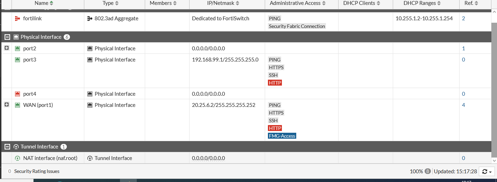

## 2. Objetos de dirección (Policy & Objects → Addresses)

| USERS-NET | SERVER-NET |
|---|---|
| 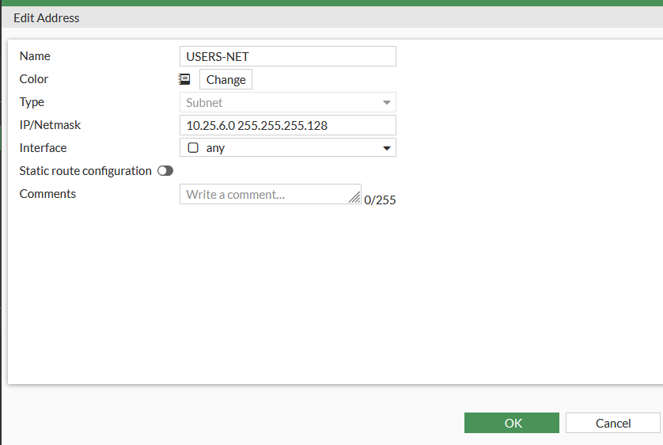 | 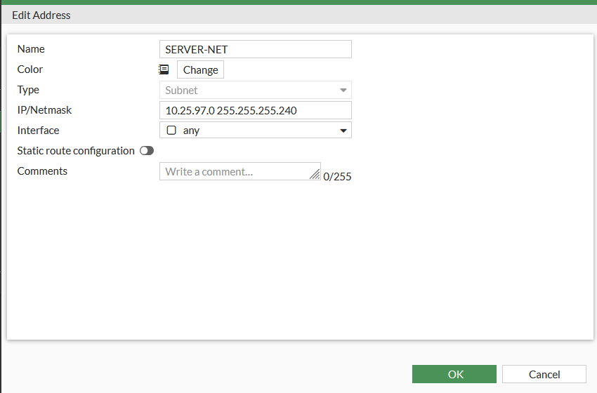 |

## 3. VPN IPsec (VPN → IPsec Tunnels → Custom)

**Red (Fase 1):** gateway remoto estático `20.25.97.2` por WAN (port1), NAT-T deshabilitado, DPD On Demand.

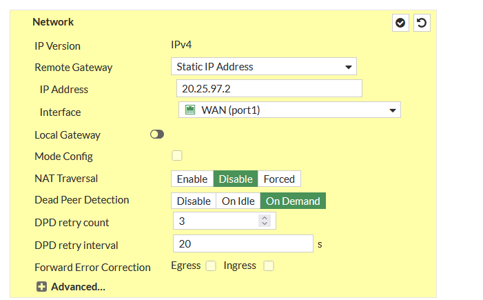

**Autenticación:** Pre-shared Key, IKE versión 2.

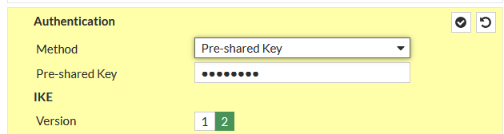

**Propuesta Fase 1:** DES / SHA256, DH grupo 14, lifetime 86400 s.

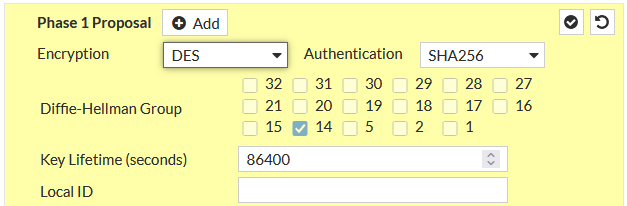

**Selectores Fase 2:** `10.25.6.0/25` ↔ `10.25.97.0/28`.

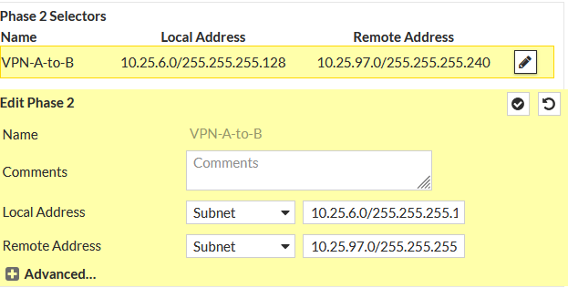

Túnel en estado **Up**:

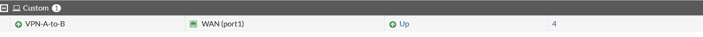

## 4. Políticas de firewall (Policy & Objects → Firewall Policy)

| Política | Origen → Destino | NAT |
|---|---|---|
| LAN-to-VPN | VLAN10_USUARIOS → VPN-A-to-B · USERS-NET → SERVER-NET | Deshabilitado |
| VPN-to-LAN | VPN-A-to-B → VLAN10_USUARIOS · SERVER-NET → USERS-NET | Deshabilitado |
| LAN-to-WAN | VLAN10_USUARIOS → WAN (port1) · all → all | **Habilitado** |
| Implicit Deny | any → any | — |

El NAT se deshabilita en las políticas del túnel para no alterar las direcciones que coinciden con los selectores de Fase 2.

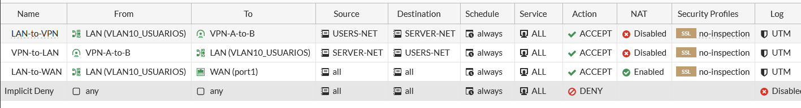

## 5. Rutas estáticas (Network → Static Routes)

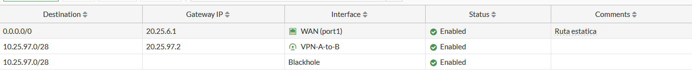

## 6. Monitoreo

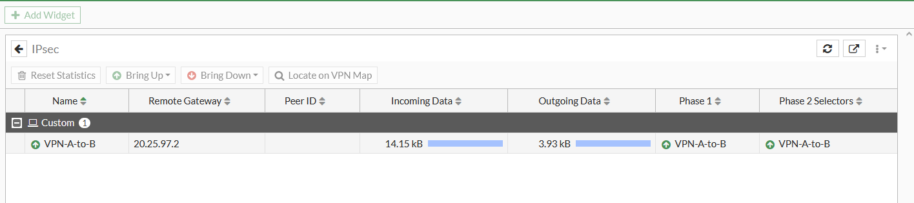

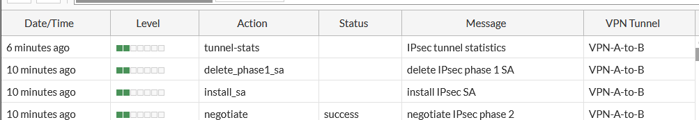
