# 04 · Configuración de FortiGate B (FTG-B) — por GUI

Running-config: [`configs/fgt-b-running-config.conf`](../configs/fgt-b-running-config.conf)

## 1. Interfaces

WAN (port1) `20.25.97.2/30`, LAN-SERVER (port2) `10.25.97.1/28`, administración port3 `192.168.98.1/24`.

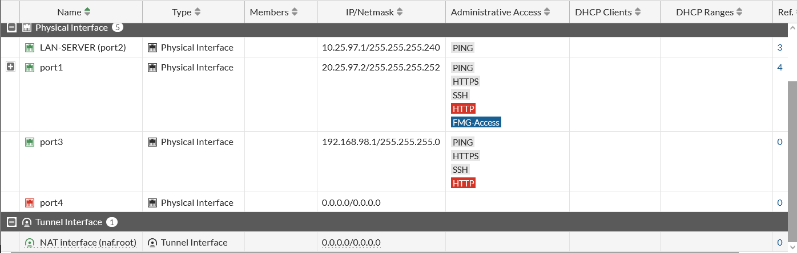

## 2. Objetos de dirección

En FTG-B el objeto de la red del servidor se llama **FTG-B** (`10.25.97.0/28`).

| USERS-NET | FTG-B (red del servidor) |
|---|---|
| 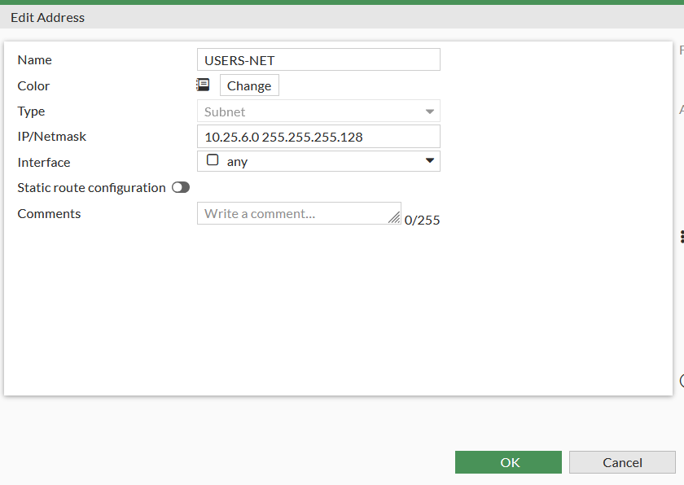 | 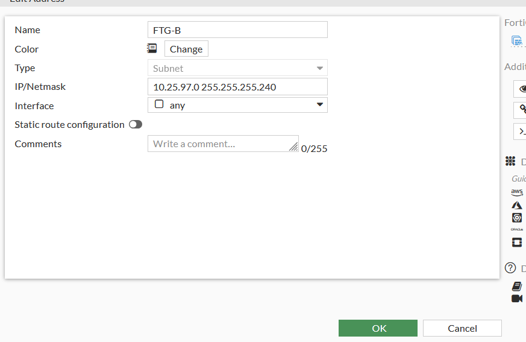 |

## 3. VPN IPsec

**Red (Fase 1):** gateway remoto `20.25.6.2` por port1.

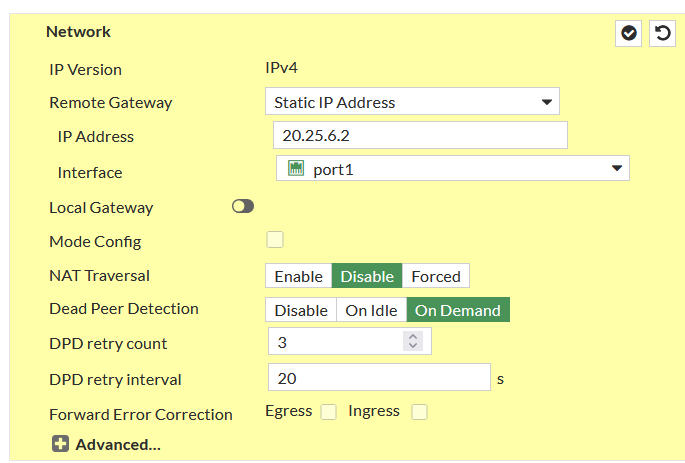

**Autenticación:** Pre-shared Key, IKE v2.

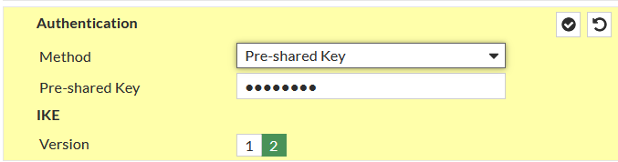

**Propuesta Fase 1:** DES / SHA256, DH 14, lifetime 86400 s.

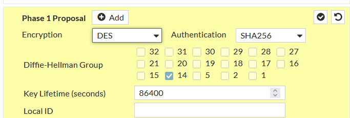

**Selectores Fase 2:** `10.25.97.0/28` ↔ `10.25.6.0/25`.

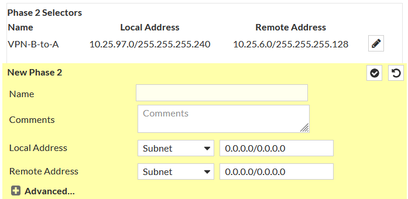

**Resumen del túnel:**

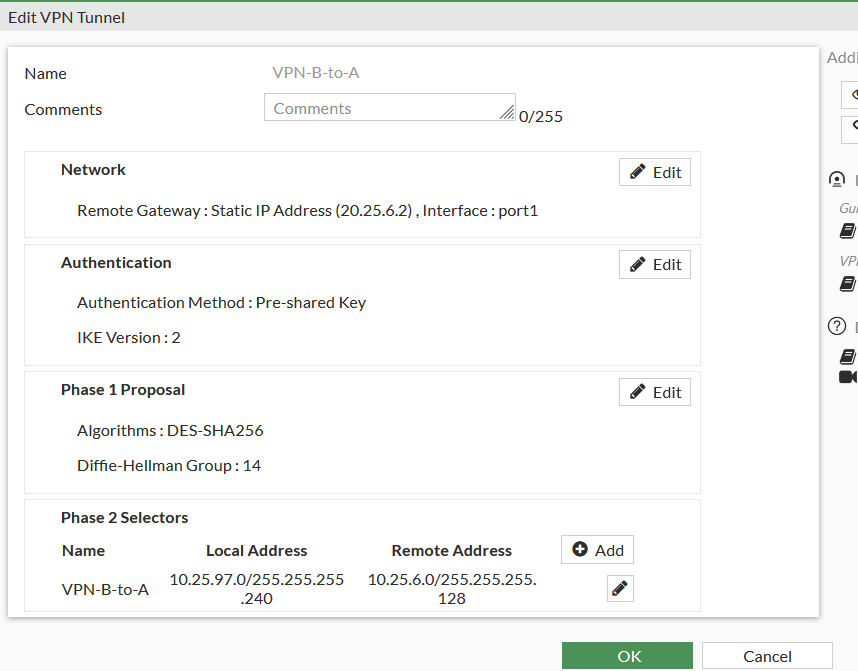

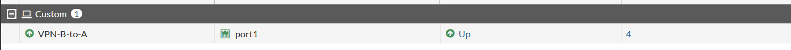

## 4. Políticas de firewall

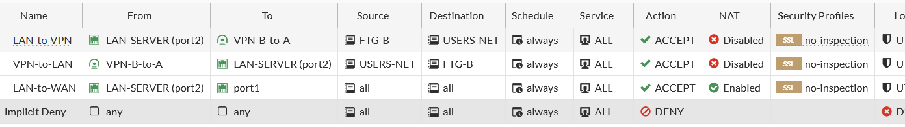

| Política | Origen → Destino | NAT |
|---|---|---|
| LAN-to-VPN | LAN-SERVER → VPN-B-to-A · FTG-B → USERS-NET | Deshabilitado |
| VPN-to-LAN | VPN-B-to-A → LAN-SERVER · USERS-NET → FTG-B | Deshabilitado |
| LAN-to-WAN | LAN-SERVER → port1 · all → all | Habilitado |
| Implicit Deny | any → any | — |

## 5. Rutas estáticas

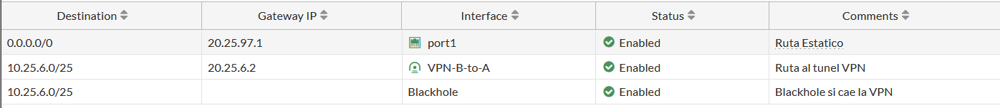

## 6. Logs de negociación

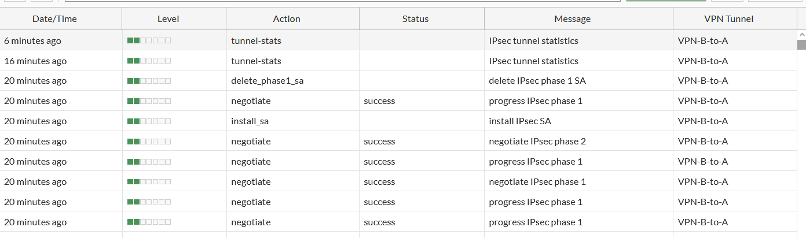
