# 05 · Pruebas y verificación

Comandos usados: [`scripts/pruebas-conectividad.bat`](../scripts/pruebas-conectividad.bat)

## A. Con el túnel VPN **ACTIVO** ✅

| # | Prueba | Resultado |
|---|---|---|
| 1 | `ipconfig` en PC1 | IP por DHCP `10.25.6.12/25`, gateway `10.25.6.1` |
| 2 | `ping 10.25.6.1` | 4/4 respuestas, TTL 255 |
| 3 | `ping 10.25.97.2` | 4/4 respuestas, TTL 62, media 22 ms |
| 4 | `tracert -d 10.25.97.2` | 3 saltos: 10.25.6.1 → 20.25.97.2 → 10.25.97.2 |
| 5 | `curl -k https://10.25.97.2` | Devuelve página Apache2 (`-k` por certificado autofirmado) |
| 6 | Navegador → servidor | Página "Apache2 Ubuntu Default Page: It works" |

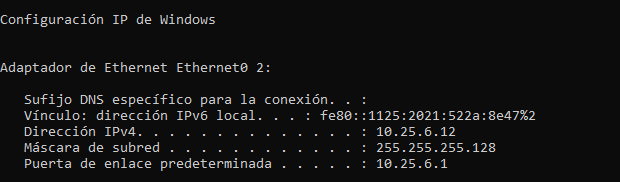
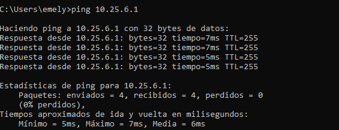
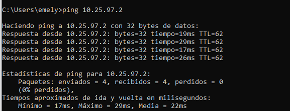
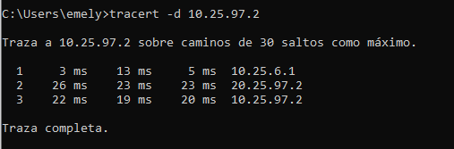
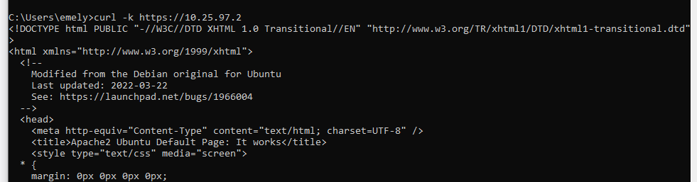
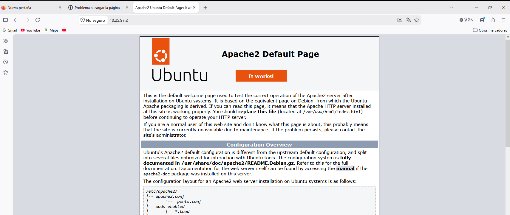

**Análisis del traceroute:** el salto 1 es el gateway de la VLAN 10 (FTG-A); el salto 2 es la IP WAN de FTG-B (extremo del túnel); el salto 3 es el servidor. El ISP no aparece porque el tráfico viaja encapsulado y cifrado en ESP.

## B. Con el túnel VPN **CAÍDO** ❌

Se bajó el túnel desde *Monitor → IPsec Monitor* en FTG-A (Phase 1 y Phase 2 en rojo, 0 B de tráfico).

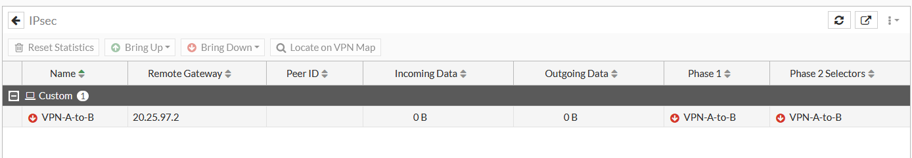

| # | Prueba | Resultado |
|---|---|---|
| 1 | `tracert -d 10.25.97.2` | Se detiene en `10.25.6.1`: *Red de destino inaccesible* |
| 2 | `ping 10.25.97.1` | *Respuesta desde 10.25.6.1: Red de destino inaccesible* |
| 3 | `ping 10.25.97.2` | *Respuesta desde 10.25.6.1: Red de destino inaccesible* |
| 4 | Navegador → servidor | La conexión ha caducado (sin respuesta) |

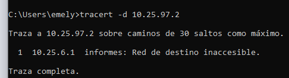
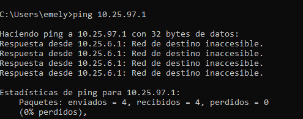
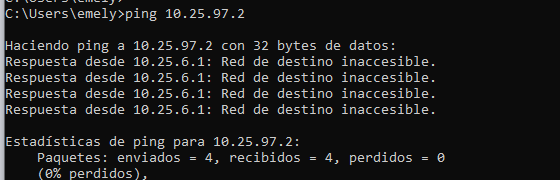
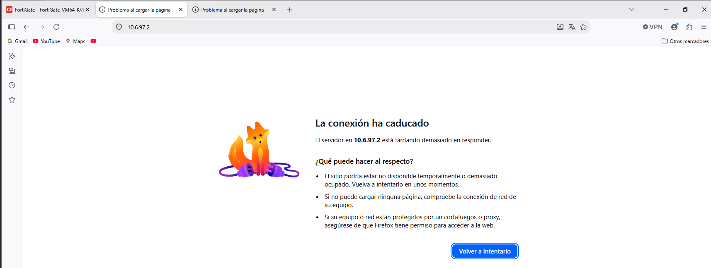

> **Nota:** Windows muestra "0% perdidos" porque recibe respuestas ICMP *destination unreachable* desde 10.25.6.1 (FTG-A). No son respuestas del servidor: es FTG-A descartando el tráfico por la ruta **Blackhole**.

## Conclusión

| Estado del túnel | Ruta usada | Resultado |
|---|---|---|
| Up | 10.25.97.0/28 vía VPN-A-to-B (dist. 10) | Comunicación exitosa |
| Down | 10.25.97.0/28 Blackhole (dist. 254) | Tráfico descartado |

Queda demostrado que **la comunicación solo fluye si el enlace VPN está activo**.
